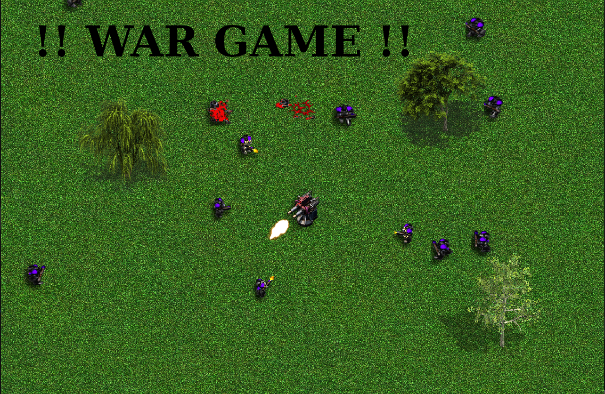

# CPPND: WarGame Capstone

This is my submission for the Capstone project in the [Udacity C++ Nanodegree Program](https://www.udacity.com/course/c-plus-plus-nanodegree--nd213). The code was partly based on the Snake Game repository.



## Game Instructions

You control a gun turret in enemy territory. Kill as many marines as you can before you are overwhelmed!
You have unlimited bullets and no overheating, so it's a good idea to just hold in the mouse button. 

## Dependencies for Running Locally
* cmake >= 3.7
  * All OSes: [click here for installation instructions](https://cmake.org/install/)
* make >= 4.1 (Linux, Mac), 3.81 (Windows)
  * Linux: make is installed by default on most Linux distros
  * Mac: [install Xcode command line tools to get make](https://developer.apple.com/xcode/features/)
  * Windows: [Click here for installation instructions](http://gnuwin32.sourceforge.net/packages/make.htm)
* SDL2 >= 2.0
  * All installation instructions can be found [here](https://wiki.libsdl.org/Installation)
  >Note that for Linux, an `apt` or `apt-get` installation is preferred to building from source. 
* gcc/g++ >= 5.4
  * Linux: gcc / g++ is installed by default on most Linux distros
  * Mac: same deal as make - [install Xcode command line tools](https://developer.apple.com/xcode/features/)
  * Windows: recommend using [MinGW](http://www.mingw.org/)  
  
### Installing SDL2

On Ubuntu, the SDL package can be installed by running the following:

```
sudo apt install cmake libsdl2-dev
sudo apt install libsdl2-image-dev
```

## Basic Build Instructions

1. Clone this repo.
2. Go to `src` directory.
3. Compile: `make all`
4. Run it: `./WarGame`.


## CC Attribution-ShareAlike 4.0 International


Shield: [![CC BY-SA 4.0][cc-by-sa-shield]][cc-by-sa]

This work is licensed under a
[Creative Commons Attribution-ShareAlike 4.0 International License][cc-by-sa].

[![CC BY-SA 4.0][cc-by-sa-image]][cc-by-sa]

[cc-by-sa]: http://creativecommons.org/licenses/by-sa/4.0/
[cc-by-sa-image]: https://licensebuttons.net/l/by-sa/4.0/88x31.png
[cc-by-sa-shield]: https://img.shields.io/badge/License-CC%20BY--SA%204.0-lightgrey.svg

## Resources Used

Here are a few tutorials for using SDL2 in C++ which I used a bit in addition to many
lookups on StackExchange and similar sites.

* https://gigi.nullneuron.net/gigilabs/writing/sdl2-tutorials/
* https://lazyfoo.net/tutorials/SDL/
